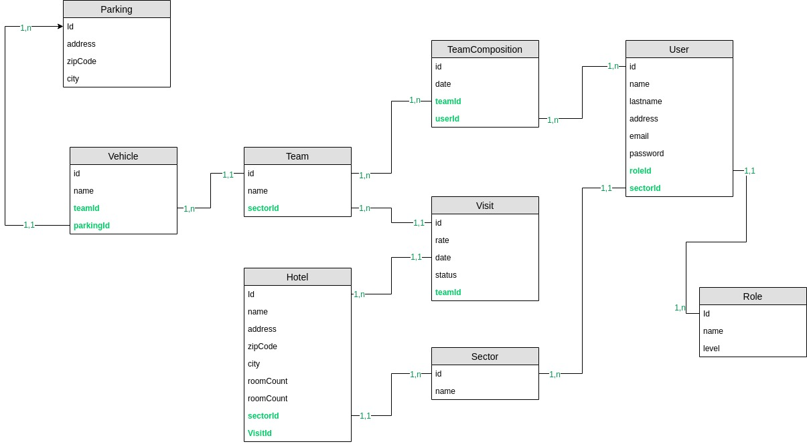

# REST API repository

# Description

This repo contains the REST API for the SSDP project.

# Contributeurs

 - Kevin MANSSAT
 - Paartheepan RAVEENTHIRAN
 - Maxime OGER

# Technologies et Libraisies

- ExpressJS ( gestion de l'api ) 
- TypeScript ( pour apporter du typage a JavaScript )
- Sequelize ( pour apporter une interface aux requettes de la base de données )
- PostgreSQL ( pour se caler sur la bdd existante du samu social de paris )
- esLint ( pour surligner la synthaxe quand elle ne respecte pas les standards qui ont été décidés par l'équipe )
- bcrypt ( pour encrypter les mots de passe avant de les enreistrer dans la base de données )
- jsonwebtoken ( pour permettre à un utilisateur authentifié d'accéder aux sections que l'api qui lui sont authorisées )

# Argumentation

### Authentification
 L'authentification se fait sur deux niveaux : visiteur et organisateur (ou admin). 
 Chaque niveau d'authentification restreint l'utilisateur à certaines parties de l'api afin qu'il puisse utiliser les fontionnalités du rôle qui lui est attribué.

 Losrqu'il est authentifié, un utilisateur se voit attribuet un token (JWT) qui contient ses informations personnelles.
 Cette clé est sauvegardée côté client durant toute la session de l'utilisateur et est utilisée pour les appels API.
 Lorsque le serveur reçoit une requette, il vérifie les informations du token et donne l'accès ou non à la ressource demandée en fonction du rôle qui se trouve dans le token.

### Code récurent
L'accès à certaines ressources de l'api nécessite de faire des actions récurentes dans l'application (vérification du token, vérification des permission, etc).
Afin d'éviter le duplicata de morceaux de code, nous stockons ces fonctions dans un middleware qui se chargera d'executer la fonction pour chaque accès à la ressource.

### Algorithme de génération du planning

L'agorithme Mickey est lancé via un appel POST à l'endpoint de Mickey `/api/mickey`. Comme toutes les routes il doit avoir un token pour pouvoir être lancé.  
Il faut donc récupérer un token depuis un navigateur après s'être connecté à la plateforme et faire un appel POST à [l'endpoint défini dans la documentation](http://15.188.3.249:5000/documentation/#api-Mickey).
> ⚠️ Il n'y a pour le moment pas de cron

# Informations complémentaires

[Cliquer ici pour accéder au Notion du projet](https://www.notion.so/Groupe-10-657ad39759404d0ea9f6217de1690b5e)

# Base de données

